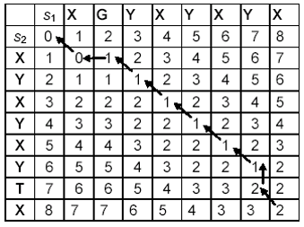

## 字符串的编辑距离
* 首先定义这样一个函数——edit(i, j)，它表示第一个字符串的长度为i的子串到第二个字符串的长度为j的子串的编辑距离。
* 显然可以有如下动态规划公式：
* 如果 i == 0 且 j == 0，edit(i, j) = 0
* 如果 i == 0 且 j > 0，edit(i, j) = j
* 如果 i > 0 且j == 0，edit(i, j) = i
* 如果 i ≥ 1  且 j ≥ 1 ，edit(i, j) = min{ edit(i-1, j) + 1, edit(i, j-1) + 1, edit(i-1, j-1) + f(i, j) }，当第一个字符串的第i个字符不等于第二个字符串的第j个字符时，f(i, j) = 1；否则，f(i, j) = 0。
